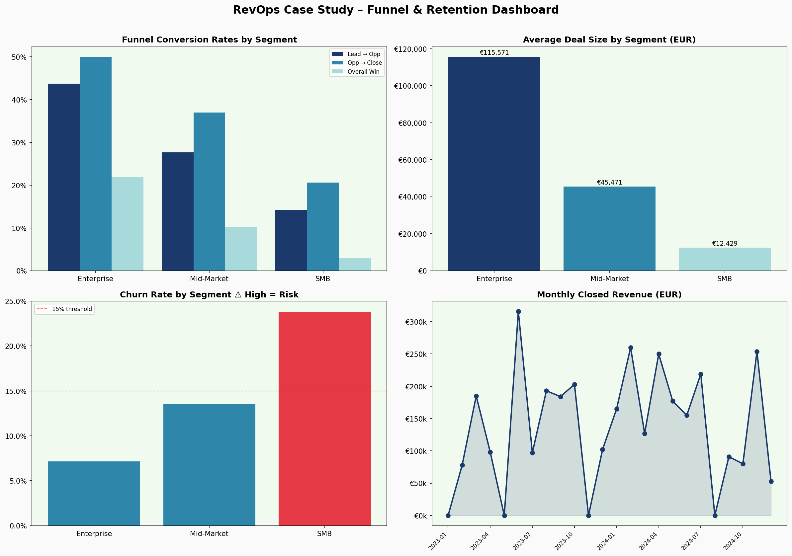

# 📊 RevOps Case Study — Revenue Funnel & Retention Analysis

> A Revenue Operations portfolio project simulating real-world challenges in funnel optimisation, churn reduction, and data-driven stakeholder decision-making.  
> Built as preparation for a RevOps Business Partner role at a SaaS/ERP company.

---

## 🧭 Problem Statement

> *"Revenue growth is plateauing. Sales cycles are long in some segments, churn is rising in others, and leadership needs clarity on where to focus."*

This project answers three core RevOps questions:

1. **Where is the funnel leaking?** — Which segments convert poorly and why?
2. **Who is at risk of churning?** — Can we identify early signals before it's too late?
3. **What should we do about it?** — Actionable recommendations, not just dashboards.

---

## 📁 Project Structure

```
revops-funnel-analysis/
│
├── data/
│   ├── leads_pipeline.csv          # 500 simulated leads across segments & sources
│   ├── customers_retention.csv     # 200 customers with ARR, churn, NPS, engagement
│   └── generate_data.py            # Reproducible data generation script
│
├── sql/
│   ├── 01_funnel_conversion.sql    # Funnel analysis: lead → opp → close
│   ├── 02_retention_churn.sql      # Churn rates, cohorts, risk signals
│   └── 03_midmarket_churn_breakdown.sql  # Mid-Market deep dive by region & industry
│
├── python/
│   └── revops_analysis.py          # Pandas analysis + matplotlib dashboard
│
├── excel/
│   └── RevOps_CaseStudy_Unit4.xlsx # Full Excel workbook (5 sheets)
│
└── docs/
    └── revops_dashboard.png        # Exported visual dashboard
```

---

## 🔬 Analysis & Key Findings

### 1. Funnel Conversion

| Segment | Lead → Opp | Opp → Close | Overall Win Rate |
|---|---|---|---|
| Enterprise | 44% | 50% | **22%** |
| Mid-Market | 28% | 37% | **10%** |
| SMB | 14% | 21% | **3%** |

**Finding:** Enterprise converts at 7x the rate of SMB. However, SMB generates the highest lead volume — raising the question of resource allocation efficiency.

### 2. Revenue Concentration

| Segment | Deals | Total Revenue | Avg Deal Size |
|---|---|---|---|
| Enterprise | 21 | €2,427,000 | €115,571 |
| Mid-Market | 17 | €773,000 | €45,471 |
| SMB | 7 | €87,000 | €12,429 |

**Finding:** Enterprise accounts for ~75% of revenue from just 4% of leads. This concentration is efficient but creates dependency risk.

### 3. Churn & Retention

| Segment | Churn Rate | ARR at Risk |
|---|---|---|
| Enterprise | 7% | ~€343k |
| Mid-Market | **14%** | ~€426k |
| SMB | **24%** | ~€226k |

**Finding:** Mid-Market is the most financially dangerous churn zone — high enough rate, high enough ARR. SMB churn is structurally high but lower in absolute impact.

### 4. Mid-Market Churn Deep Dive

The 14% average masks significant variation underneath. Breaking down by region and industry reveals where the problem is actually concentrated.

**By Region:**

| Region | Customers | Churn Rate | ARR at Risk |
|---|---|---|---|
| AMER | 24 | **21%** 🔴 | €199k |
| APAC | 27 | 11% | €141k |
| EMEA | 23 | 9% | €95k |

**By Industry:**

| Industry | Customers | Churn Rate | ARR at Risk |
|---|---|---|---|
| Education | 14 | **29%** 🔴 | €181k |
| Healthcare | 16 | 19% 🟡 | €113k |
| Manufacturing | 12 | 8% | €44k |
| Professional Services | 14 | 7% | €40k |
| Public Sector | 18 | 6% | €57k |

**Finding:** The 14% Mid-Market average is misleading. AMER is at 21% — more than double EMEA. Education as a vertical is at 29% — nearly double the segment average. The critical next question (see `sql/03_midmarket_churn_breakdown.sql`) is whether AMER churn is concentrated in Education or spread across industries — because that distinction changes the recommended action entirely.

---

## 💡 Recommendations

### Short-term (0–90 days)
- **Launch CSM outreach** to the 15–20 High Risk accounts identified in the Churn Risk Register (Excel Sheet 4), prioritised by ARR
- **Review SMB lead qualification criteria** — current 3% win rate suggests either poor targeting or insufficient qualification gates in CRM

### Medium-term (90–180 days)
- **Build a Mid-Market retention playbook** — NPS ≤5 + login inactivity >60 days should trigger automatic CS escalation
- **Audit partner channel pipeline** — Partner-sourced leads show highest conversion; validate with larger sample before scaling investment

### Strategic (6–12 months)
- **Rebalance ICP toward Enterprise and upper Mid-Market** — LTV-to-CAC is structurally better; SMB resources should be evaluated against opportunity cost
- **Introduce ARR concentration monitoring** — if top 5 Enterprise accounts represent >50% of ARR, implement dedicated account risk reporting for CFO/Board

---

## ❓ Ambiguous Cases (Built for Stakeholder Discussion)

These are data signals that cannot be resolved by analysis alone — they require business judgment and cross-functional alignment. Documented in **Excel Sheet 5**.

| Case | The Tension |
|---|---|
| SMB ROI | Win rate is 3% — cut investment or improve qualification? |
| Mid-Market Churn | 14% is just below 15% risk flag — act now or wait? |
| Enterprise Concentration | ~75% revenue from 21 deals — risk or expected for this ICP? |
| Partner Channel | Best conversion rate, but small sample (n≈40) — scale or validate first? |
| NPS as Churn Predictor | Low NPS correlates with inactivity — make it a formal CS trigger? |

> These cases demonstrate the RevOps function at its most valuable: **translating ambiguous data into structured decisions for senior stakeholders**.

---

## 🛠 Tech Stack

| Tool | Purpose |
|---|---|
| Python (pandas, matplotlib) | Data generation, analysis, visualisation |
| SQL (SQLite-compatible) | Ad-hoc funnel and retention queries |
| Excel (openpyxl) | Stakeholder-ready workbook with formulas, pivot summaries, risk register |
| Git/GitHub | Version control and portfolio presentation |

---

## 📌 How to Run

```bash
# 1. Generate datasets
python data/generate_data.py

# 2. Run analysis + export dashboard
cd python && python revops_analysis.py

# 3. Build Excel workbook
cd excel && python build_excel.py

# 4. Run SQL queries (any SQLite client, e.g. DBeaver, DB Browser)
# Import leads_pipeline.csv and customers_retention.csv as tables
```

---

## 🎯 Relevance to RevOps Business Partner Role

This project directly maps to the responsibilities and qualifications listed for RevOps roles in SaaS/ERP environments:

- ✅ **Funnel productivity analysis** across lead stages
- ✅ **CRM-style data modelling** (Dynamics 365 equivalent logic)
- ✅ **Excel proficiency** — formulas, structured tables, cohort pivots, risk register
- ✅ **Stakeholder communication** — ambiguous case framing for senior management
- ✅ **Churn & retention metrics** — standard SaaS KPIs (churn rate, ARR at risk, NPS correlation)
- ✅ **Cross-functional thinking** — recommendations framed for Sales, CS, Marketing, and Finance

  ---



*Dataset is fully simulated. All numbers are fictional and for portfolio purposes only.*

➕ 🔮 Revenue Forecast (6 Months)
📊 Headline

Base forecast: €845k
Range: €634k – €1.01M (±45%)

🧠 Key Insight

Revenue is deal-driven, not trend-driven

High volatility (low predictability)
Outcomes depend on a small number of Enterprise deals
⚠️ Key Risks
Enterprise concentration → few deals drive most revenue
Forecast uncertainty → weak historical trend (R² ≈ 0)
Mid-Market churn (~14%) → potential downside risk
🎯 Implications
Use scenario ranges, not single-point forecasts
Focus on deal execution and renewals
Forecast accuracy depends more on pipeline quality than historical trend
📈 Scenarios
Scenario	Revenue
Pessimistic	€633k
Base	€845k
Optimistic	€1.01M
🧭 Takeaway

“Managing execution risk is more critical than predicting trends.”


